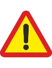

[Acceso a las instalaciones y recorridos internos]{.span4}

 

[El centro educativo debe instaurar medidas organizativas que impidan
las aglomeraciones de personas y propicien el correcto cumplimiento de
las medidas de distancia interpersonal de seguridad durante el acceso,
tránsito interior y abandono del centro educativo.]{.span3}

 

[Marcar con una ]{.span7}[X]{.span16}[ la situación que se ajuste a su
centro y protocolizar las medidas que correspondan adaptándolas a las
condiciones particulares de su centro.]{.span7}

 

[x]{.span17}

[Tanto el recinto como el edificio disponen de varias
entradas.]{.span18}

 

 

[Organizar el acceso de forma diferenciada, estableciendo un acceso para
la entrada y otro para la salida del edificio o recinto.]{.span6}

 

 

[El centro dispone de una única puerta de acceso a las
instalaciones.]{.span18}

 

 

[Señalizar una zona de espera en el exterior del acceso, teniendo
preferencia el sentido de salida sobre la entrada.]{.span6}

 

[Este sentido puede ser fijado de forma diferente en determinados
momentos. Por ejemplo, al inicio de la jornada escolar la preferencia
será el sentido de entrada al centro con respecto al de salida, debiendo
esperar quien necesite salir a que finalice el acceso de todo el
alumnado y personal del centro.]{.span7}

 

[X]{.span17}

 

[Establecer horas de entrada y salida diferenciadas por enseñanza, etapa
o curso.]{.span6}

[Establecer recorridos de flujo de circulación de personas en pasillos y
zonas comunes.]{.span6}

[Señalizar los recorridos de acceso a las aulas, salida al patio y
entrada y salida del edificio.]{.span6}

[Colocar marcas de separación de distancia mínima en pasillos y zonas
comunes.]{.span6}

[La circulación de personas será ordenada y distanciada. Evitar el
tránsito individual por pasillos.]{.span6}

{.frame3}\
 

 

 

 

 

[x]{.span17}

[Es posible que se reciban visitas externas al centro.]{.span18}

 

 

[Instalar en la entrada una zona de desinfección con:]{.span6}

[Gel hidroalcohólico.]{.span6}

[Pañuelos de papel.]{.span6}

[Papelera de pedal o recipiente similar.]{.span6}

 

[x]{.span17}

[Es obligatorio el uso de la mascarilla en el centro docente.]{.span18}

 

 

[Colocar carteles informativos indicando la obligatoriedad del uso de
mascarilla en las distintas estancias del edificio.]{.span6}

 

[El real Decreto 21/2020, de 9 de junio, establece en su artículo 6 la
obligatoriedad de llevar mascarilla en lugares públicos
cerrados.]{.span7}

[Asimismo, el documento de la Comisión Mixta de Salud y Educación
establece que en los centros educativos la mascarilla será obligatoria a
partir de los 6 años y recomendable de 3 a 5 años]{.span7}

 

 
