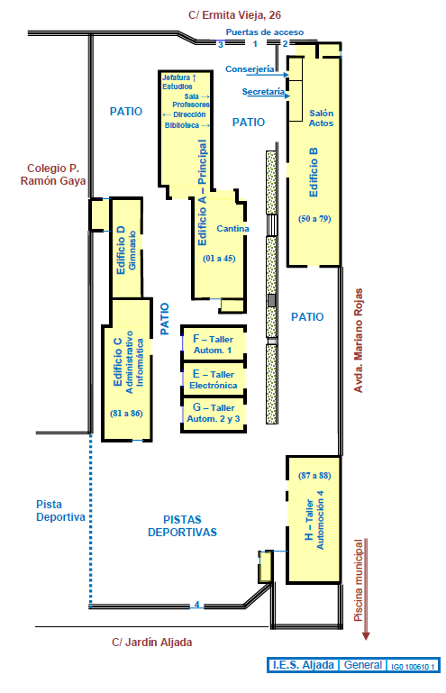
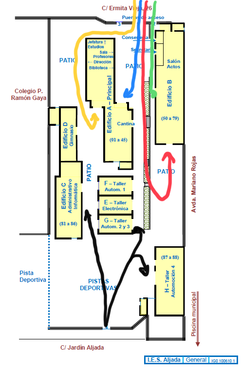

[PROTOCOLO DE ACCESO, TRÁNSITO Y ABANDONO DEL CENTRO]{.span4}[ ]{.span4}

 

[Acceso y usos de espacios comunes:]{.span19}

 

[Acceso a las instalaciones y recorridos internos.]{.span10}

 

[Los accesos al centro se realizarán de forma ordenada respetando en la
medida de lo posible la distancia de 1,5 m y siendo obligatorio, ante
posibles situaciones en las que no pueda mantenerse la distancia de
seguridad, el uso de mascarilla ]{.span3}[durante la entrada. Se
colocarán carteles informativos en los lugares de acceso al centro
informando de la obligatoriedad del uso de mascarillas en todo el
recinto. ]{.span3}

 

[Dado que el centro tiene diferentes puertas de acceso que permiten
organizar la entrada y salida del alumnado, en vez de realizar
escalonamiento de los horarios se habilitarán los diferentes accesos,
organizando los mismos de forma que se eviten aglomeraciones en la
entrada. En los horarios de entrada y salida el flujo de circulación
será en un solo sentido. En el horario de entrada, de 8:25 a 8:35 el
sentido será único de acceso al centro y toda persona que quiera
abandonar el centro deberá esperar a que finalice el periodo de entrada
general. Análogamente, en el horario de salida, de 14:25 a 14:35 el
sentido será únicamente de salida, teniendo que aguardar toda persona
que quiera acceder al mismo la finalización del periodo de
salida.]{.span3}

{.frame4} 

[Los ]{.span3}[recorridos de acceso y salida del centro]{.span10}[ se
realizarán de la siguiente forma:]{.span3}

 

[Los alumnos accederán al centro por las puertas 1, 2 y 4. Los accesos a
los edificios A y B serán diferenciados en función de la planta de
ubicación de la clase de acuerdo al siguiente esquema:]{.span3}

 

[Los alumnos cuyas aulas se encuentre en la primera planta del pabellón
A accederán por la entrada al edificio A, situada frente al patio, y
subirán a sus aulas por las escaleras situadas junto a la entrada. Este
recorrido se distinguirá en azul.]{.span3}

[Los alumnos cuyas aulas se encuentren en la segunda planta del pabellón
A accederán siguiendo la ruta de acceso "amarilla" y subirán por las
escaleras situadas junto a su entrada al pabellón A.]{.span3}

[Los alumnos cuyas aulas se encuentren en la primera planta del pabellón
B accederán siguiendo la ruta de acceso "verde" y subirán por las
escaleras situadas junto a su entrada al pabellón B.]{.span3}

[Los alumnos cuyas aulas se encuentren en la segunda planta del pabellón
B accederán siguiendo la ruta de acceso "Roja" y subirán por las
escaleras situadas junto a su entrada al pabellón A.]{.span3}

[Los alumnos que accedan a los edificios C y D o a los talleres lo harán
a traves de la puerta 4, siguiendo las rutas de acceso color
negro.]{.span3}

 

{.frame5} 

 

[Se señalizarán las rutas de acesso con el correspondiente color de
forma que sea claramente visible la ruta a seguir por medio de carteles
en la entrada y señales en el suelo. ]{.span3}

 

[La salida del centro se realizará siguiendo el mismo esquema que la
entrada pero en sentido inverso, permitiendo durante el periodo de
salida la circulación unicamente en sentido de salida. Además, en la
salida del centro se seguira el protocolo establecido en el plan de
autoprotección del centro para la evacuación de cada una de las plantas.
El profesorado regulará la salida del aula de los alumnos en orden
inverso a la cercania a la escalera de salida de la respectiva planta.
En el caso de la escalera central del pabellón B se comenzará por la
parte izquierda (aula 60).]{.span3}

 

[Los docentes y resto de personal del centro accederán por la puerta 3,
de forma que tengan un acceso diferenciado del alumnado.]{.span3}

 

[Recorridos en los intercambios de clase:]{.span10}[ Para minimizar la
distancia y uso de recorridos internos cada grupo permanecerá el maximo
tiempo posible en un mismo aula siendo los profesores los que
principalmente se desplacen en los intercambios de clase. Aún así,
debido a las diferentes materias que cursan los alumnos de un grupo,
será necesario el desplazamiento de algunos alumnos en los intercambios
de clase. Para minimizar el recorrido en estos desplazamientos se
tratará de tener el mayor numero posible de aulas de un mismo nivel en
la misma planta del mismo edificio. Para estos desplazamientos en los
intercambios de clase los alumnos circularán pegados a la parte derecha
del pasillo y escaleras manteniedo la distancia de seguridad.]{.span3}

 

[Supervisión de la entrada y salida del centro: ]{.span10}[La
supervisión de la entrada y la salida del centro será realizada por los
profesores de guardia. Para tal fin se reservarán tres profesores de
guardia uno para el pabellón A, otro para el B y otro que supervisará el
acceso a los pabellones C, D y talleres, quedando el resto de profesores
de guardia a disposición de las posibles necesidades por ausencias o
retrasos. Los profesores de guardia que realicen la supervisión de
entrada se incorporarán al turno de guardia habitual una vez finalizado
el periodo de entrada.]{.span3}

 
