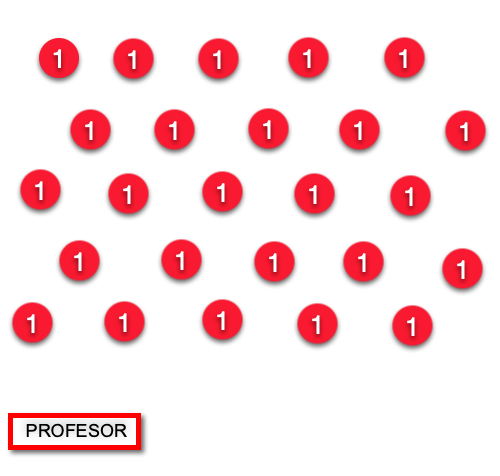

[Aforos máximos en aulas.]{.span4}

 

[De acuerdo a las instrucciones se intentará respetar el distanciamiento
de 1,5 m en las aulas y espacios comunes. Dadas las circunstancias de
espacios, recursos y número de alumnado de nuestro centro los aforos
máximos de aulas que permitan mantener la distancia de seguridad se
verán superados en algunas de las aulas. Por tanto, si un aula supera el
aforo máximo ]{.span3}[ ]{.span3}[en alguna sesión entonces será
obligatorio el uso de mascarillas durante toda la sesión.]{.span3}

 

[Los aforos máximos serán señalizados en cada una de las aulas y
recogido en el horario que se pone al principio de curso en la mesa del
profesor de cada aula. Si el profesor observa que se supera este aforo
máximo recordará a los alumnos no podrán quitarse las mascarillas en
ningún momento de esa sesión. ]{.span3}

 

[Del mismo modo, a la entrada de las zonas comunes, como gimnasios,
vestuarios, biblioteca, departamentos, sala de profesores y salón de
actos se expresará el aforo máximo permitido. Si por necesidad se
superara en algún momento dicho aforo y no se pudiera guardar la
distancia de seguridad, el uso de mascarilla será obligatorio.]{.span3}

 

[Propuesta de distribución de aula para maximizar las distancias en
aulas con falta de espacio:]{.span3}

{.frame8} 

[Esta propuesta en zig-zag permite maximizar las distancias entre las
personas al hablar, dado que el alumno que está mirando hacia delante,
en el momento de hablar tiene una distancia mayor de metro y medio hasta
el siguiente alumnos, permitiendo un menor riesgo de contagio.]{.span3}

[EDIFICIO A]{.span20}

[A01]{.span20}

[60]{.span21}

 

 

[28]{.span21}

[Aula Música]{.span21}

[A02]{.span20}

[60]{.span21}

[SI]{.span21}

 

[15]{.span21}

[Aula Informática (Tecnología)]{.span21}

[A03]{.span20}

[85]{.span21}

 

 

[25]{.span21}

[Aula Taller (Tecnología)]{.span21}

[A11]{.span20}

[30]{.span21}

 

 

[10]{.span21}

[Aula PT]{.span21}

[A12]{.span20}

[60]{.span21}

 

 

[28]{.span21}

 

[A13]{.span20}

[60]{.span21}

 

 

[28]{.span21}

 

[A14]{.span20}

[78,5]{.span21}

[SI]{.span21}

 

[32]{.span21}

 

[A15]{.span20}

[60]{.span21}

 

 

[28]{.span21}

 

[A16]{.span20}

[60]{.span21}

[SI]{.span21}

 

[28]{.span21}

 

[A17]{.span20}

[60]{.span21}

[SI]{.span21}

 

[28]{.span21}

 

[A21]{.span20}

[60]{.span21}

[SI]{.span21}

 

[28]{.span21}

[Aula Informática (Plumier)]{.span21}

[A22]{.span20}

[60]{.span21}

 

 

[28]{.span21}

 

[A23]{.span20}

[60]{.span21}

 

 

[28]{.span21}

 

[A24]{.span20}

[60]{.span21}

 

 

[28]{.span21}

[Laboratorio (FQ)]{.span21}

[A25]{.span20}

[60]{.span21}

[SI]{.span21}

 

[28]{.span21}

 

[A31]{.span20}

[90]{.span21}

[SI]{.span21}

 

[28]{.span21}

[Aula Informática (Ad. y Gestión)]{.span21}

[A32]{.span20}

[60]{.span21}

 

 

[28]{.span21}

 

[A33]{.span20}

[60]{.span21}

 

 

[28]{.span21}

 

[A34]{.span20}

[78,5]{.span21}

[SI]{.span21}

 

[32]{.span21}

 

[A35]{.span20}

[60]{.span21}

 

 

[28]{.span21}

 

[A37]{.span20}

[30]{.span21}

 

 

[10]{.span21}

 

[A38]{.span20}

[30]{.span21}

 

 

[10]{.span21}

 

[A41]{.span20}

[60]{.span21}

[SI]{.span21}

 

[28]{.span21}

 

[A42]{.span20}

[60]{.span21}

[SI]{.span21}

 

[28]{.span21}

 

[A43]{.span20}

[60]{.span21}

[SI]{.span21}

 

[28]{.span21}

 

[A44]{.span20}

[60]{.span21}

 

 

[15]{.span21}

[Aula Plástica]{.span21}

[A45]{.span20}

[60]{.span21}

 

 

[28]{.span21}

 

[EDIFICIO B]{.span20}

[B50]{.span20}

[23,5]{.span21}

 

 

[8]{.span21}

[Aula PT]{.span21}

[B51]{.span20}

[23,5]{.span21}

 

 

[8]{.span21}

[Aula PT]{.span21}

[B52]{.span20}

[60]{.span21}

 

 

[28]{.span21}

[Aula Música]{.span21}

[B53]{.span20}

[90]{.span21}

 

 

[28]{.span21}

[Aula Taller (Tecnología)]{.span21}

[B54]{.span20}

[70]{.span21}

 

 

[22]{.span21}

[Laboratorio (Biología)]{.span21}

[B60]{.span20}

[48]{.span21}

 

 

[20]{.span21}

[AULA ABIERTA]{.span21}

[B61]{.span20}

[48]{.span21}

[SI]{.span21}

 

[20]{.span21}

 

[B62]{.span20}

[48]{.span21}

[SI]{.span21}

 

[20]{.span21}

 

[B63]{.span20}

[48]{.span21}

 

 

[20]{.span21}

 

[B64]{.span20}

[48]{.span21}

 

 

[20]{.span21}

 

[B65]{.span20}

[48]{.span21}

 

 

[20]{.span21}

 

[B66]{.span20}

[66]{.span21}

 

 

[32]{.span21}

[Aula Plástica]{.span21}

[B67]{.span20}

[66]{.span21}

 

 

[32]{.span21}

 

[B68]{.span20}

[66]{.span21}

 

 

[32]{.span21}

 

[B69]{.span20}

[38]{.span21}

[SI]{.span21}

 

[12]{.span21}

[Aula Informática (Plumier)]{.span21}

[B70]{.span20}

[48]{.span21}

 

 

[20]{.span21}

 

[B71]{.span20}

[48]{.span21}

 

 

[20]{.span21}

 

[B72]{.span20}

[48]{.span21}

 

 

[20]{.span21}

 

[B73]{.span20}

[48]{.span21}

 

 

[20]{.span21}

 

[B74]{.span20}

[48]{.span21}

 

 

[20]{.span21}

 

[B75]{.span20}

[48]{.span21}

 

 

[20]{.span21}

 

[B76]{.span20}

[66]{.span21}

 

 

[32]{.span21}

 

[B77]{.span20}

[66]{.span21}

[SI]{.span21}

 

[32]{.span21}

 

[B78]{.span20}

[66]{.span21}

 

 

[32]{.span21}

 

[B79]{.span20}

[66]{.span21}

 

 

[32]{.span21}

 

[EDIFICIO C]{.span20}

[C81]{.span20}

[58]{.span28}

 

 

[27]{.span28}

 

[C82]{.span20}

[91]{.span28}

[SI]{.span28}

 

[25]{.span28}

[Aula Informática (Informática)]{.span28}

[C83]{.span20}

[58]{.span28}

 

 

[27]{.span28}

 

[C84]{.span20}

[58]{.span28}

[SI]{.span28}

 

[20]{.span28}

[Aula Informática (Informática)]{.span28}

[C85]{.span20}

[59]{.span28}

[SI]{.span28}

 

[20]{.span28}

[Aula Informática (Ad. Y Gestión)]{.span28}

[C86]{.span20}

[88]{.span28}

[SI]{.span28}

 

[25]{.span28}

[Aula Informática (Ad. Y Gestión)]{.span28}

[EDIFICIO H]{.span20}

[H87]{.span20}

[58]{.span28}

[SI]{.span28}

 

[20]{.span28}

[Aula Automoción]{.span28}

[H88]{.span20}

[58]{.span28}

[SI]{.span28}

 

[20]{.span28}

[Aula Automoción]{.span28}

 

[EDIFICIO E]{.span20}

[Taller 1]{.span20}

[72]{.span21}

 

 

[23]{.span21}

[Talleres Electrónica]{.span21}

[Taller 2]{.span20}

[104]{.span21}

 

 

[30]{.span21}

[Taller 3]{.span20}

[97]{.span21}

 

 

[29]{.span21}

[EDIFICIOS F , G y H]{.span20}

[Taller 1]{.span20}

[190]{.span21}

 

 

[30]{.span21}

[Talleres Automoción]{.span21}

[Taller 2]{.span20}

[200]{.span21}

 

 

[Taller 3]{.span20}

[100]{.span21}

 

 

[Taller 4]{.span20}

[200]{.span21}

 

 

 

[GIMNASIO]{.span24}

[AULA]{.span20}

[M2]{.span20}

[A/A]{.span20}

 

[AFORO]{.span20}

[Observaciones]{.span20}

[Edificio D]{.span20}

[153]{.span21}

 

 

[30]{.span21}

 

 
