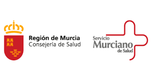
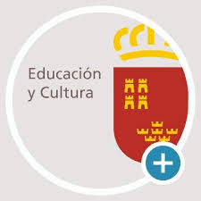

[CANALES DE COMUNICACIÓN ENTRE EQUIPOS DIRECTIVOS Y TRABAJADORES Y ENTRE
EL CENTRO EDUCATIVO Y ALUMNADO, PADRES, TUTORES Y DEMAS COMUNIDAD
EDUCATIVA]{.span4}

 

{.frame10}\
[El equipo directivo debe asegurar que la información sobre los
protocolos de actuación y las medidas de prevención, higiene y promoción
de la salud implantadas en los centros educativos son conocidas y
comprendidas por toda la comunidad educativa.]{.span26}

 

[A continuación se relacionan los canales de comunicación establecidos
por el IES \_\_\_\_\_\_\_\_\_ con los distintos actores que participan
directamente en la determinación, implementación y mantenimiento de las
medidas y protocolos de este Plan de Contingencia, necesarios para
asegurar un entorno escolar seguro para todos los miembros de la
comunidad educativa y evitar nuevos contagios.]{.span51}

 

[Canal de comunicación entre:]{.span3}

[Equipo directivo y personal docente y no docente adscrito]{.span41}

 

[Se realizará a través del email corporativo proporcionado por la
Consejería de Educación (\@murciaeduca.es, \@carm.es), utilizándolo para
el envío de convocatorias y otra documentación pertinente.]{.span26}

 

 

[Las diferentes reuniones propias del Centro: reuniones de tramo;
Claustros; Comisión de Coordinación Pedagógica... se llevarán a cabo a
través de la herramienta sincrónica propia de Google, "Google Meet",
dadas las garantías de seguridad que nos proporciona.]{.span26}

 

 

 

 

[Canal de comunicación entre:]{.span3}

[Centro educativo y centro de salud de referencia]{.span41}

 

[Se recomienda que desde el inicio del curso escolar, a través del
equipo directivo y los profesionales sanitarios de referencia de los
equipos de atención primaria, se retome la comunicación entre los
centros educativos y los centros de salud de cada zona básica de salud.
]{.span26}

 

[Así, Los centros de salud, dentro de sus competencias de salud
comunitaria, podrán apoyar en las medidas de protección, prevención,
higiene y protección de la salud de la comunidad educativa y alumnado
así como en la implantación de programas específicos de educación para
la salud. Asimismo colaborará junto con Salud Pública en la resolución
de dudas e incidencias que puedan surgir ante posibles casos que puedan
tener síntomas compatibles con infección por SARS-CoV-2]{.span26}

 

[Centro de Salud de \_\_\_\_\_\_\_\_\_. ]{.span3}

[Dirección: \_\_\_\_\_\_\_\_]{.span54}

[Teléfono ]{.span3}[968 \_\_\_\_\_\_\_\_\_\_\_\_\_]{.span54}

 

 

[Canal de comunicación entre:]{.span3}

[Centro educativo y alumnos]{.span41}

 

[Para favorecer el proceso de enseñanza-aprendizaje se utilizarán las
siguiente herramientas que ]{.span26}[ofrecen las garantías suficientes
en materia de privacidad y protección de datos, accesibilidad y
facilidad de uso:]{.span26}

 

[MEET: videoconferencias para tutorías, impartir docencia...]{.span3}

[CLASSROOM y AULA VIRTUAL: se trata de canales bidireccionales en los
que el profesorado colgará las tareas y podrán recibir un feedback
directo por parte del alumnado.]{.span3}

[BLOG EDUCATIVO (BLOGGER) y WEB DEL CENTRO. ]{.span3}[Se informará de
las tareas diarias.]{.span3}

[EMAIL de la Consejería de Educación y Cultura: los alumnos de primaria
tendrán ]{.span3}[su dirección y contraseña del mail proporcionado por
la Consejería para realizar las comunicaciones con el Centro.]{.span3}

 

[Canal de comunicación entre:]{.span3}

[Centro educativo y padres, madres y tutores]{.span41}

 

[Se enviará la información a todas las familias, manteniendo un canal
disponible para la solución de dudas que puedan surgir.]{.span26}

 

 

[A estos efectos para la comunicación entre el Centro Educativo y las
familias utilizaremos los siguientes canales:]{.span26}

 

[Para notificaciones generales del Centro se utilizará la aplicación
oficial de la Consejería de Educación, "TOKAPP", que deben tener
instalada todas las familias del Centro.]{.span26}

[Para la comunicación entre profesorado y familias utilizaremos la
plataforma\_\_\_\_\_\_\_\_\_\_\_, el email corporativo \@murciaeduca.es,
llamadas telefónicas, web del Centro.]{.span26}

[La comunicación con el AMPA será a través de llamada telefónica, email
y la aplicación TOKAPP. ]{.span26}

 

 

[También participarán las familias a través de la]{.span26}[ Comisión
Plan Contingencia frente al covid-19]{.span41}[, cuya acta de
constitución deberá recogerse en este plan.]{.span26}

 

 

[Canal de comunicación entre:]{.span3}

[Centro educativo y Consejería de Salud]{.span41}

 

[Para la coordinación entre los centros educativos y el Servicio de
Epidemiología se establece el siguiente buzón de correo:]{.span3}

 

 

[Correo del Servicio de Epidemiología de la Dirección General de Salud
Pública]{.span3}

[[vigilancia.epidemiologica\@carm.es]{.span55}](mailto:vigilancia.epidemiologica@carm.es)

 

 

[Canal de comunicación entre:]{.span3}

[Centro educativo y Consejería de Educación y Cultura]{.span41}

 

[El centro podrá recabar del Servicio de Prevención de Riesgos Laborales
la ayuda o colaboración necesarias para la elaboración y puesta en
marcha del presente plan.]{.span26}

 

[Técnico de PRL asignado al asesoramiento: \_\_\_\_\_\_\_\_\_\_]{.span3}

 

[Así mismo para una correcta gestión y coordinación entre los centros
educativos y el Servicio de Prevención de Riesgos Laborales se
establecen los siguientes buzones de correo:]{.span3}

 

 

[Correo y teléfono general de contacto con el SPRL]{.span26}

 

[[sprl\_educacion\@murciaeduca.es]{.span55}](mailto:sprl_educacion@murciaeduca.es)

 

[Correo específico para comunicación de casos posibles, probables o
confirmados]{.span26}

 

[[coordinacion\_coronavirus\@murciaeduca.es]{.span55}](mailto:coordinacion_coronavirus@murciaeduca.es)

 

[Correo de dudas sobre la implantación de las medidas preventivas en los
centros educativos.]{.span26}

[[sprl\_dudascoronavirus\@murciaeduca.es]{.span55}](mailto:sprl_dudascoronavirus@murciaeduca.es)

 

[Correo de incidencias en la recepción de medios de protección y
asesoramiento sobre uso y adquisición de los mismos]{.span26}

 

[[sprl\_incidenciascovid\@murciaeduca.es]{.span55}](mailto:sprl_incidenciascovid@murciaeduca.es)

 

 

[Canal de comunicación entre:]{.span3}

[Centro educativo y otras asociaciones]{.span41}

 

[Se utilizará tanto el email como las llamadas telefónicas para la
comunicación con dichas asociaciones.]{.span3}

 

 

 

 

 

[Canal de comunicación]{.span56}

[Observaciones]{.span56}

 

[Equipo directivo]{.span56}

[Centro docente]{.span56}

 

{.frame11} 

[Correo electrónico]{.span57}

[\@murciaeduca.es]{.span56}

[Convocatorias]{.span57}

[Otros documentos]{.span57}

[Personal docente]{.span57}

[{.frame12}](https://www.google.com/url?sa=i&url=https://es.wikipedia.org/wiki/Google_Meet&psig=AOvVaw2wOcPzHfs3-Kg2KJOi5qO-&ust=1593425111858000&source=images&cd=vfe&ved=0CAIQjRxqFwoTCMiEjKChpOoCFQAAAAAdAAAAABAE) 

[reuniones de tramo]{.span14}

[Claustros]{.span14}

[Comisión de Coordinación Pedagógica... ]{.span14}

{.frame11} 

[Correo electrónico]{.span57}

[\@carm.es]{.span56}

[Personal no docente]{.span57}

[{.frame13}](https://www.google.com/url?sa=i&url=https://es.wikipedia.org/wiki/Archivo:%C3%8Dcono_Tel%C3%A9fono_-_telefon%C3%ADa.JPG&psig=AOvVaw1UWmw3kZmkeOa8qI71vo9G&ust=1593425512484000&source=images&cd=vfe&ved=0CAIQjRxqFwoTCIjWkN-ipOoCFQAAAAAdAAAAABAK) 

[Teléfono]{.span57}

[968]{.span56}

[Centro de salud]{.span57}

[[vigilancia.epidemiologica\@carm.es]{.span58}](mailto:vigilancia.epidemiologica@carm.es)

[{.frame14}](https://www.google.com/url?sa=i&url=https://tiposdesangre.org/&psig=AOvVaw1d85DK3dZup3cR2Q2UbovR&ust=1593426618783000&source=images&cd=vfe&ved=0CAIQjRxqFwoTCLCKw-6mpOoCFQAAAAAdAAAAABAK) 

[[sprl\_educacion\@murciaeduca.es]{.span58}](mailto:sprl_educacion@murciaeduca.es)

[[coordinacion\_coronavirus\@murciaeduca.es]{.span58}](mailto:coordinacion_coronavirus@murciaeduca.es)

[sprl\_dudascoronavirus\@murciaeduca.es]{.span58}

[[sprl\_incidenciascovid\@murciaeduca.es]{.span58}](mailto:sprl_incidenciascovid@murciaeduca.es)

 

[{.frame15}](https://www.google.com/url?sa=i&url=https://twitter.com/educarm?lang%3Del&psig=AOvVaw1g5hgthm5KH42LEvjJg6aH&ust=1593426733183000&source=images&cd=vfe&ved=0CAIQjRxqFwoTCIjojqWnpOoCFQAAAAAdAAAAABAE) 

[{.frame16}](https://www.google.com/url?sa=i&url=https://tokapp.com/school/&psig=AOvVaw16H2SpGTuc_CQUMUssnRcA&ust=1593426259455000&source=images&cd=vfe&ved=0CAIQjRxqFwoTCLjcmMOlpOoCFQAAAAAdAAAAABAE) 

[Notificaciones]{.span57}

[Padres -- Madres / tutores]{.span57}

[AMPA]{.span57}

[Profesores]{.span57}

[Docentes]{.span57}

{.frame11} 

[Correo electrónico]{.span57}

[{.frame13}](https://www.google.com/url?sa=i&url=https://es.wikipedia.org/wiki/Archivo:%C3%8Dcono_Tel%C3%A9fono_-_telefon%C3%ADa.JPG&psig=AOvVaw1UWmw3kZmkeOa8qI71vo9G&ust=1593425512484000&source=images&cd=vfe&ved=0CAIQjRxqFwoTCIjWkN-ipOoCFQAAAAAdAAAAABAK) 

[Teléfono]{.span57}

[{.frame16}](https://www.google.com/url?sa=i&url=https://tokapp.com/school/&psig=AOvVaw16H2SpGTuc_CQUMUssnRcA&ust=1593426259455000&source=images&cd=vfe&ved=0CAIQjRxqFwoTCLjcmMOlpOoCFQAAAAAdAAAAABAE) 

[{.frame17}](https://www.google.com/url?sa=i&url=https://es.wikipedia.org/wiki/Google_Meet&psig=AOvVaw2wOcPzHfs3-Kg2KJOi5qO-&ust=1593425111858000&source=images&cd=vfe&ved=0CAIQjRxqFwoTCMiEjKChpOoCFQAAAAAdAAAAABAE) 

[Web del centro]{.span56}

[https://www.murciaeduca.es]{.span56}

[Alumnos]{.span57}

[{.frame18}](https://www.google.com/url?sa=i&url=https://www.rauldiego.es/google-classroom/&psig=AOvVaw0VQbPObW73mIWajw7rqkXR&ust=1593425683129000&source=images&cd=vfe&ved=0CAIQjRxqFwoTCLiErbCjpOoCFQAAAAAdAAAAABAE) 

[{.frame19}](https://www.google.com/url?sa=i&url=https://aulavirtual.murciaeduca.es/&psig=AOvVaw0Lqo2zkmIMlDVJCEsOX2rA&ust=1593426025135000&source=images&cd=vfe&ved=0CAIQjRxqFwoTCKibwNOkpOoCFQAAAAAdAAAAABAE) 

[{.frame20}](https://www.google.com/url?sa=i&url=https://www.rauldiego.es/blogger/&psig=AOvVaw3XH6okw80zs2rro4aiMqDj&ust=1593425874940000&source=images&cd=vfe&ved=0CAIQjRxqFwoTCKiu64ukpOoCFQAAAAAdAAAAABAE) 

{.frame11} 

[Correo electrónico]{.span57}

[\@murciaeduca.es]{.span56}

[ANEXO I]{.span59}

 

[INSTRUCCIONES PARA ALUMNOS]{.span60}

 

[Antes de ir al centro]{.span41}

 

[Si presentas síntomas compatibles con COVID-19 (fiebre, tos, sensación
de falta de aire, disminución del olfato y del gusto, escalofríos, dolor
de garganta, dolor de cabeza, debilidad general, dolores musculares,
diarrea o vómitos) no debes acudir al centro y tienes que contactar con
el teléfono de tu centro de Atención Primaria o Al teléfono 900121212 y
seguir sus instrucciones.]{.span6}

[Tampoco puedes acudir al centro si te encuentras en periodo de
cuarentena domiciliaria por haber tenido contacto con alguna persona con
síntomas o diagnosticado de COVID-19. ]{.span6}

[No debes acudir al centro educativo hasta que finalice el periodo de
aislamiento. ]{.span6}

[Si has estado en contacto estrecho (familiares, convivientes y personas
que hayan tenido contacto con el caso, desde 48 horas antes del inicio
de síntomas, a una distancia menor de 2 metros, durante un tiempo de al
menos 15 minutos) o has compartido espacio sin guardar la distancia
interpersonal durante más de 15 minutos con una persona afectada por el
COVID-19, tampoco debes acudir al centro educativo, incluso en ausencia
de síntomas, por un espacio de al menos 14 días. Durante ese periodo tus
profesionales sanitarios de referencia de Atención Primaria realizarán
el seguimiento por si aparecen síntomas de la enfermedad. ]{.span6}

[Si utilizas el transporte público para acudir al centro educativo,
evita las aglomeraciones, utiliza mascarilla y mantén en todo momento la
distancia interpersonal de seguridad. ]{.span6}

[Es conveniente que prepares todo lo necesario para las clases de forma
que no sea necesario utilizar material prestado ni compartir objetos con
tus compañeros. ]{.span6}

[Llévate tu propia bebida puesto que las fuentes de agua potable estarán
clausuradas.]{.span6}

[Lee atentamente el protocolo de acceso y salidas del centro educativo y
sé puntual en los horarios asignados a tu grupo. ]{.span6}

[(Incluir aquí lo recogido en los horarios e indicaciones de acceso al
centro educativo, punto 7 del Plan de contingencia)]{.span61}

 

[Cuando vayas al centro educativo]{.span41}

 

[Localiza las zonas de entrada y salida al centro que estarán
señalizadas adecuadamente con el fin de facilitar los accesos y permitir
la distancia interpersonal de seguridad.]{.span6}

[Dirígete a la puerta de acceso al recinto preservando una distancia
interpersonal mínima de dos metros tanto con compañeros como con el
personal del centro educativo.]{.span6}

[Posibilita la tarea a la persona que organiza el acceso o salida al
centro y colabora con ellos para impedir que se formen aglomeraciones.
]{.span6}

[Lee, respeta y cumple con lo que aparece reflejado en los carteles
informativos sobre higiene de manos y medidas de prevención colocados en
el centro. ]{.span6}

[Respeta las medidas de prevención e higiene específicas implementadas
en tu centro y que se te han remitido en el protocolo de actuación para
usuarios y alumnos. ]{.span6}

 

[Dentro del aula]{.span41}

 

[Accede al aula de manera ordenada, manteniendo la distancia mientras
esperas tu turno.]{.span6}

[Mantén en todo momento la distancia de seguridad de 1,5 metros dentro
del aula, tanto con los compañeros como con el docente.]{.span6}

[No compartas objetos personales, ni material escolar, como elementos de
escritura, calculadoras, otros. Debes asegurarte de llevar todo lo
necesario para poder seguir las clases. ]{.span6}

[En caso de ser inevitable el compartir algún material, extrema las
medidas de higiene y prevención (higiene de manos, evitar tocarse nariz,
ojos y boca...) y lávate las manos cuanto antes o utiliza gel
desinfectante.]{.span6}

[Desinfecta los instrumentos o elementos comunes, que hayan sido
utilizados por el docente o por alguno de tus compañeros. ]{.span6}

[Si tienes clases seguidas, no debes de abandonar el aula en el cambio
entre clase y clase.]{.span6}

[Al finalizar la actividad docente, deberás dejar despejada tu mesa y tu
silla del aula, con el fin de facilitar las tareas de limpieza y
desinfección.]{.span6}

 

 

[Durante los descansos y accesos a las zonas comunes]{.span41}

 

[Procura relacionarte en grupos pequeños manteniendo siempre las
distancias de seguridad entre vosotros.]{.span6}

[Evita formar aglomeraciones en las instalaciones del centro educativo y
procura realizar los descansos en zonas al aire libre, no obstaculices
los pasillos de acceso y zonas de paso. ]{.span6}

[Respeta las señales establecidas y mantente en los espacios habilitados
para los descansos respetando las posibles zonas restringidas. ]{.span6}

[Debes volver a entrar al edificio cumpliendo con las medidas de
prevención que te indique tu centro educativo y guardando las distancias
de seguridad.]{.span6}

[Evita tocar si no es necesario objetos de otras personas o superficies
en las zonas comunes.]{.span6}

[Si utilizas los ordenadores del centro, tras su uso, limpia con una
solución desinfectante el teclado, el ratón y la pantalla.]{.span6}

 

[Al salir del centro y volver a casa]{.span41}

 

[Colabora con el personal que organiza la salida e impide que se formen
aglomeraciones en las puertas.]{.span6}

[Vigila atentamente tu estado de salud y el de tus allegados más
cercanos. ]{.span6}

[Antes de salir del centro lávate las manos con agua y jabón y, en su
defecto, con gel desinfectante de manos.]{.span6}

[Al llegar a casa, se recomienda lavarse las manos con agua y jabón,
quitarse los zapatos y, como medida de higiene, se sustituirán por
calzado para estar en casa.]{.span6}

[Debes cuidar las distancias y seguir las medidas de prevención de
contagios e higiene en el hogar, máxime si convives con personas de
grupos vulnerables para COVID-19.]{.span6}

 

 

[Normas generales de prevención e higiene para el alumnado]{.span62}

 

[Higiene de manos en el entorno escolar]{.span41}

 

[Se recomienda mantener en todo momento una correcta higiene de
manos.]{.span6}

[El lavado de manos con agua y jabón es la primera medida de elección,
en caso de que no sea posible proceder al lavado frecuente se dispondrá
de gel desinfectante de manos para mantener la higiene
adecuada.]{.span6}

[Cuando las manos tienen suciedad visible el gel desinfectante de manos
no es suficiente, y será necesario usar agua y jabón.]{.span6}

[Sigue lo indicado en los carteles sobre la técnica correcta de higiene
de manos durante 40 segundos con agua y jabón o durante 20 segundos con
solución hidroalcohólica. ]{.span6}

[La higiene de manos se realizará como mínimo en las siguientes
situaciones:]{.span6}

 

[Al finalizar y empezar la jornada escolar.]{.span6}

[Después de ir al lavabo.]{.span6}

[Antes y después de ir al váter.]{.span6}

[Después de toser, estornudar o sonarse la nariz.]{.span6}

[Antes y después de salir al patio.]{.span6}

[Antes y después de comer.]{.span6}

[Después de cada contacto con fluidos corporales de otras
personas.]{.span6}

[Antes y después de ponerse o retirarse una mascarilla.]{.span6}

[Siempre que las manos estén visiblemente sucias.]{.span6}

[Después de usar o compartir espacios múltiples o equipos (como mesas
ratones de ordenador etc.).]{.span6}

 

[Evitar dar la mano.]{.span6}

[Se deben extremar estas medidas de higiene y prevención en caso de
compartir objetos.]{.span6}

 

[Higiene respiratoria en el entorno escolar.]{.span5}

 

[Al toser o estornudar cubrir la boca y la nariz con el codo flexionado
o con un pañuelo desechable.]{.span6}

[Evitar tocarse la nariz los ojos y la boca y aunque las manos facilitan
la transmisión.]{.span6}

[Usar pañuelos desechables para eliminar secreciones respiratorias y
tirarlos tras su uso a una papelera con tapa y pedal.]{.span6}

[Tras toser estornudas se deben lavar las manos con agua y jabón o con
solución hidroalcohólica.]{.span6}

 

[Higiene bucal en el entorno escolar]{.span5}

 

[Se desaconseja el cepillado de los dientes en el centro docente en
estos momentos por la dificultad de garantizar el distanciamiento de
seguridad entre los niños en los baños compartidos, así como por el
riesgo de contacto en el caso de salpicaduras de saliva o que puedan
compartir alguno de sus elementos de higiene. Las organizaciones
colegiales de odontólogos consideran suficiente para la correcta higiene
dental diaria realizar dos cepillados al día ya que realizar el
cepillado en el colegio puede ocasionar un mayor riesgo de contagio. Se
puede seguir con un buen cuidado dental manteniendo los buenos hábitos
de higiene bucodental en casa antes y después de acudir al
colegio.]{.span6}

 

[Uso de mascarilla en el entorno escolar]{.span5}

 

[Las personas de seis años en adelante están obligadas al uso de
mascarillas dentro del centro escolar. La mascarilla indicada para
población sana será tipo higiénica y siempre que sea posible,
reutilizable.]{.span6}

[Al centro deberás entrar con mascarilla y llevarla durante toda la
jornada escolar. El centro escolar dispondrá de mascarillas desechables
para poder reponer en caso de necesidad por rotura o imprevisto, aunque
es recomendable llevar otra de repuesto por si le fuera
necesaria.]{.span6}

[En educación infantil la mascarilla no será obligatoria aunque si
recomendable de 3 a 5 años para las entradas y salidas del alumnado y
siempre que no estén en el grupo estable.]{.span6}

[Para el resto de niveles educativos desde 1º de Primaria la mascarilla
será obligatoria tanto dentro como fuera del aula. En todo caso podrán
quitársela en determinados momentos en lo que todos estén sentados en
los pupitres y siempre bajo la supervisión y autorización del
profesor.]{.span6}

[Su uso será obligatorio además en el transporte escolar colectivo a
partir de los 6 años y recomendable desde los 3 años.]{.span6}

 

+-----------------------------------------------------------------------+
| [Si una persona que comienza a desarrollar síntomas compatibles con   |
| COVID-19 en el centro educativo se llevará a un espacio separado de   |
| uso individual y se le colocará una mascarilla quirúrgica.]{.span6}   |
+-----------------------------------------------------------------------+

 

[Recomendaciones generales]{.span5}

 

[Se adoptaran medidas para evitar el contacto con superficies que puedan
estar contaminadas (por ejemplo: mantener las puerta abiertas para
evitar contacto con pomos menillas, barandillas etc.)]{.span6}

[Se limitará el desplazamiento de alumnos por la clase, preferentemente
será el profesor quien se acerque a la mesa de cada alumno.]{.span6}

[Se recomienda que el alumnado no intercambie mesas, sillas o pupitres,
de manera, que todos los días y en todas las clases utilice el mismo
lugar.]{.span6}

[Se limitará al máximo posible el empleo de documentos en papel y su
circulación contando cada alumno con su propio cuaderno o material en
papel necesario.]{.span6}

[Debe evitarse en la medida de lo posible compartir material y realizar
asiduamente y cuando sea preciso la desinfección de materiales de uso
común.]{.span6}

[En caso de compartir objetos se extremarán las medidas de higiene y
prevención (higiene de manos evitar tocarse nariz, ojos y
boca...)]{.span6}

[Los objetos de uso personal como gafas, estuches, tablets..., se
limpiarán con frecuencia con los productos indicados, pudiendo usarse
para ello un paño limpio con solución hidroalcohólica, jabón o alcohol y
desecharlo después.]{.span21}

[Cada alumno a partir de Educación Primaria llevará su propia solución
hidroalcohólica y botella de agua para beber.]{.span6}

[Cuando el alumno abandone el aula a lo largo de la jornada escolar
utilizará toallitas, paños o bayetas desechables y productos
desinfectantes (alcohol de 70º o toallitas desinfectantes) adecuadas
para limpiar superficies y objetos (pupitres, teclados, ratones de
ordenador...)]{.span6}

 

 

 

 

 

 

[ANEXO II]{.span59}

[INSTRUCCIONES PARA PADRES, MADRES O TUTORES]{.span60}

 

[En caso de mostrar síntomas de la enfermedad de COVID-19 no envíe a su
hijo al centro ]{.span3}

 

[Antes de ir al centro]{.span41}

[No debe llevar a su hijo al centro educativo:]{.span41}

 

[Si presenta síntomas compatibles con COVID-19:]{.span3}

[Fiebre o febrícula (\>37,2)]{.span3}

[Tos]{.span3}

[Congestión nasal]{.span3}

[Dolor de garganta]{.span3}

[Dificultad respiratoria]{.span3}

[Dolor torácico]{.span3}

[Dolor de cabeza]{.span3}

[Dolor abdominal]{.span3}

[Vómitos ]{.span3}

[Diarrea]{.span3}

[Dolor muscular]{.span3}

[Malestar general]{.span3}

[Lesiones o manchas en la piel]{.span3}

[Disminución del olfato y el gusto]{.span3}

[Escalofríos]{.span3}

 

[Antes de enviar al centro educativo a sus hijos, los padres revise si
presenta estos síntomas, en particular, le tomará la temperatura. En
caso de presentar cualquiera de estos síntomas deberá contactar con el
teléfono de tu centro de Atención Primaria, con su médico pediatra o al
teléfono 900121212 y seguir sus instrucciones. ]{.span3}

 

[Tampoco puedes llevarlo al centro si se encuentra en periodo de
cuarentena domiciliaria por haber tenido contacto con alguna persona con
síntomas o ]{.span3}[diagnosticado de COVID-19. No debes acudir al
centro educativo hasta que finalice el periodo de aislamiento. ]{.span3}

[Si ha estado en contacto estrecho (familiares, convivientes y personas
que hayan tenido contacto con el caso, desde 48 horas antes del inicio
de síntomas, a una distancia menor de 2 metros, durante un tiempo de al
menos 15 minutos) o ha compartido espacio sin guardar la distancia
interpersonal durante más de 15 minutos con una persona afectada por el
COVID-19, tampoco debe acudir al centro educativo, incluso en ausencia
de síntomas, por un espacio de al menos 14 días. Durante ese periodo tus
profesionales sanitarios de referencia de Atención Primaria realizarán
el seguimiento por si aparecen síntomas de la enfermedad. ]{.span3}

 

[Accesos y horarios establecidos.]{.span41}

 

[Lea atentamente el protocolo de acceso y salidas del centro educativo y
sea puntual en los horarios asignados al grupo de su hijo. ]{.span3}

[(Incluir aquí lo recogido en los horarios e indicaciones de acceso al
centro educativo, punto 7 del Plan de contingencia)]{.span63}

[Los padres o tutores no podrán acceder al centro educativo sin permiso
del equipo directivo o el profesor de su hijo. Para poder acceder al
mismo para cualquier gestión será necesario solicitar cita previa
]{.span3}[ ]{.span3}[(incluir aquí método de solicitud de cota
previa)]{.span63}

[Recuerde a su hijo la obligación de cumplir con los horarios
establecidos y con los recorridos de acceso a las aulas.]{.span3}

[Evite pararse en zonas establecidas de acceso o paso, pudiendo provocar
aglomeraciones.]{.span3}

 

[Uso de mascarilla en el entorno escolar]{.span41}

 

[Las personas de seis años en adelante están obligadas al uso de
mascarillas dentro del centro escolar. La mascarilla indicada para
población sana será tipo higiénica y siempre que sea posible,
reutilizable.]{.span3}

[Su hijo deberá ir provisto de mascarilla antes de entrar al centro y
llevarla durante toda la jornada escolar. El centro escolar dispondrá de
mascarillas desechables para poder reponer al alumnado en caso de
necesidad por rotura o imprevisto, aunque se recomienda que lleve otra
de repuesto por si le fuera necesaria.]{.span3}

[El uso de mascarilla no será exigible en alumnos que presenten algún
tipo de enfermedad o dificultad respiratoria que pueda verse agravada
por el uso de la mascarilla o que, por su situación de discapacidad o
dependencia, no dispongan de autonomía para quitarse la mascarilla o
bien presenten alteraciones de conducta que hagan inviable su
utilización.]{.span3}

[Tampoco será exigible en el caso de ejercicio de deporte individual al
aire libre.]{.span3}

[En educación infantil la mascarilla no será obligatoria aunque si
recomendable de 3 a 5 años para las entradas y salidas del alumnado y
siempre que no estén en el grupo estable.]{.span3}

[Para el resto de niveles educativos desde 1º de Primaria la mascarilla
será obligatoria tanto dentro como fuera del aula. En todo caso podrán
quitársela en determinados momentos en lo que todos estén sentados en
los pupitres y siempre bajo la supervisión y autorización del
profesor.]{.span3}

[Su uso será obligatorio además en el transporte escolar colectivo a
partir de los 6 años y recomendable desde los 3 años.]{.span3}

 

[Higiene y prevención en el entorno escolar]{.span41}

 

[El centro escolar ha establecido unas medidas de higiene de manos e
higiene respiratoria que debe ser reforzada desde casa. Recuerde a su
hijo la importancia de seguir estas indicaciones.]{.span3}

[La higiene de manos se realizará como mínimo en las siguientes
situaciones:]{.span3}

[Al finalizar y empezar la jornada escolar.]{.span3}

[Después de ir al lavabo.]{.span3}

[Antes y después de ir al váter.]{.span3}

[Después de toser, estornudar o sonarse la nariz.]{.span3}

[Antes y después de salir al patio.]{.span3}

[Antes y después de comer.]{.span3}

[Después de cada contacto con fluidos corporales de otras
personas.]{.span3}

[Antes y después de ponerse o retirarse una mascarilla.]{.span3}

[Siempre que las manos estén visiblemente sucias.]{.span3}

[Después de usar o compartir espacios múltiples o equipos (como mesas
ratones de ordenador etc.).]{.span3}

[Al toser o estornudar cubrir la boca y la nariz con el codo flexionado
o con un pañuelo desechable.]{.span3}

[Evitar tocarse la nariz los ojos y la boca y aunque las manos facilitan
la transmisión.]{.span3}

[Usar pañuelos desechables para eliminar secreciones respiratorias y
tirarlos tras su uso a una papelera con tapa y pedal.]{.span3}

[Tras toser estornudas se deben lavar las manos con agua y jabón o con
solución hidroalcohólica.]{.span3}

[Se desaconseja el cepillado de los dientes en la escuela en estos
momentos por la dificultad de garantizar el distanciamiento de seguridad
entre los niños en los baños compartidos, así como por el riesgo de
contacto en el caso de salpicaduras de saliva o que puedan compartir
alguno de sus elementos de higiene. Las organizaciones colegiales de
odontólogos consideran suficiente para la correcta higiene dental diaria
realizar dos cepillados al día ya que realizar el cepillado en el
colegio puede ocasionar un mayor riesgo de contagio. Se puede seguir con
un buen cuidado dental manteniendo los buenos hábitos de higiene
bucodental en casa antes y después de acudir al colegio.]{.span3}

[Se evitaran las actividades deportivas, lúdicas o colaborativas que
implique el acceso a entornos públicos (museos, excursiones,
teatros....) o la posibilidad de mezclarse con otros grupos de alumnos o
centros escolares. En particular bajo el principio de cautela y
prevención se evitaran los viajes de estudios graduaciones y actos
instituciones similares mientras dure la crisis sanitaria.]{.span3}

[Las actividades extraescolares dentro del propio centro deberán
contemplar las medidas de distanciamiento e higiene indicadas en el
presente documento. En cualquier caso se deben programar en grupos
estables de convivencia.]{.span3}

[En todo caso los eventos deportivos o celebraciones del centros en los
que este prevista la asistencia de público deberán asegurar que se puede
mantener la distancia interpersonal y el aforo recogido en las
indicaciones sanitarias.]{.span3}

 

[Si acude a realizar cualquier actuación en dependencias del IES
\_\_\_\_\_\_\_\_\_\_\_]{.span9}

 

[Durante su estancia en el centro use siempre mascarilla.]{.span3}

[Mantenga la distancia interpersonal mínima de 1,5 metros con personal
del centro y alumnos y otras personas presentes.]{.span3}

[Sea puntual en la cita solicitada, acuda con los impresos rellenos en
su caso, resuelva dudas por teléfono, procure acudir sin compañía, y
permanezca en el centro el tiempo estrictamente necesario.]{.span3}

[Facilite la tarea del personal del centro que organizan el acceso y
colabore con ellos impidiendo formar aglomeraciones. No obstaculice
zonas de acceso ni se detenga en lugares establecidos como de paso. Siga
escrupulosamente todas las instrucciones que le soliciten en su centro y
las establecidas en los carteles indicativos.]{.span3}

[En la medida de lo posible, evite tocar objetos. Antes y después de ser
atendido, lávese las manos en el aseo habilitado para ello o use gel
hidro-alcohólico, si lo estima necesario.]{.span3}

 

[Durante la entrada y salida del alumnado]{.span9}

 

[Colabore con el personal que organiza la salida e impida que se formen
aglomeraciones en las puertas. ]{.span3}

[Vigile atentamente su estado de salud y el de sus allegados más
cercanos.]{.span3}

[Debe cuidar las distancias y seguir las medidas de prevención de
contagios e higiene.]{.span3}

 

[Recuerde, todas estas medidas son imprescindibles para evitar
contagios. Por nuestra salud y la de nuestras familias. GRACIAS POR SU
COLABORACIÓN]{.span64}
